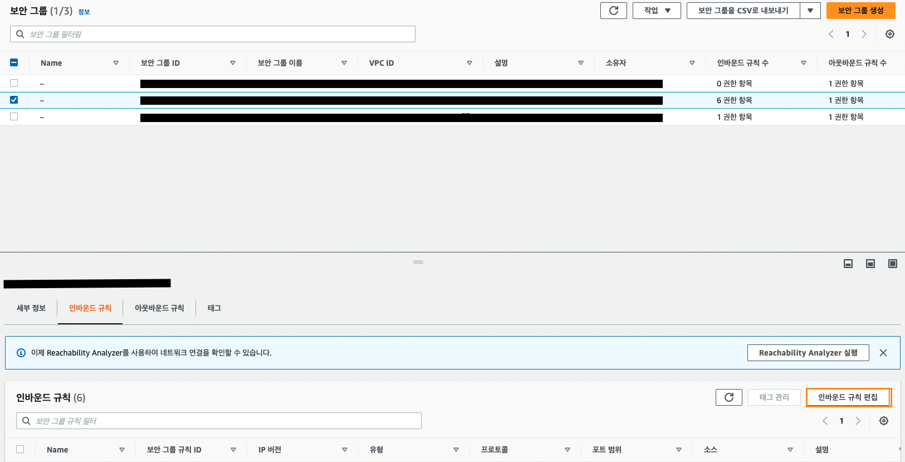

## AWS EC2 보안 그룹 설정하기 (React, Spring)

### 보안 그룹(Security Group)이란?
> 보안 그룹이란 AWS EC2의 가상의 방화벽이며, 인바운드와 아웃바운드를 설정할 수 있다. 

#### 아웃바운드 Outbound란?
**아웃바운드**는 'EC2 인스턴스에서 나가는' 트래픽을 의미한다.  
데이터를 EC2 인스턴스에서 내보내는 트래픽에 대해 적용되는 규칙이다.  
기본값으로는 모든 트래픽을 허용하지만, 인바운드처럼 규칙을 적용하여 트래픽을 필터링할 수 있다.

 

#### 인바운드 Inbound란?
**인바운드**란 'EC2 인스턴스로 들어오는' 트래픽을 의미한다.  
SSH 접속 포트인 22번은 개발자 PC에서만 접근이 가능하게 설정이 가능하며, 서비스 포트인 80번은 모든 사람이 접근하게 할 수 있다.  

MySql, Spring, React와 같이 열어줘야 하는  포트가 있는 경우에는 **인바운드 규칙**에서 해당 포트를 열어주어야 접속이 가능하다.  
만일 포트가 열려 있지 않은 경우에는 서버가 제대로 가동 중이라고 해도 접속이 불가하다.  

대체로 개발 환경에 맞춰 인바운드 규칙을 설정하는데,  
최근에 진행했던 프로젝트가 프론트엔드는 React를 백엔드는 Spring을 사용했기 때문에 해당 환경에 맞춰서 설정을 해보겠다.

 

### 인바운드 Inbound 규칙 설정하기

#### 1. 보안 그룹 설정 페이지로 이동하기

먼저 AWS의 EC2 서비스로 이동한 후, 왼쪽 하단의 **네트워크 및 보안** 탭의 하위 항목의 **보안 그룹**을 선택한다.

#### 2-1. 보안 그룹 생성을 통한 보안 그룹 설정

만일 보안 그룹을 새로 생성하고자 하는 경우에는 오른쪽 위의 **보안 그룹 생성** 버튼을 누른다.  

#### 2-2. 기존 보안 그룹의 인바운드 규칙 변경

만일 기존에 존재하던 보안 그룹의 인바운드 규칙을 변경하고자 하는 경우에는  
변경하고자 하는 보안 그룹을 선택한 후, 오른쪽 하단의 '인바운드 규칙 편집'을 선택하여 규칙을 변경할 수 있다.

#### 3. 보안 그룹의 인바운드 규칙 변경

이제 인바운드 규칙에 원하고자 하는 포트를 열어주면 된다.  

이 때, 개발 환경에 맞춰서 설정을 해주면 된다.  
"규칙 추가" 버튼을 누르고 원하는 규칙을 추가하자. Spring - React 환경을 예로 들어보자.  

먼저 Spring은 8080 포트를 사용하고, React는 3000 포트를 사용한다.  
"유형"에는 "사용자 지정 TCP"를, "포트 범위"에는 각각 8080과 3000을 입력하고, "소스"를 "Anywhere-IPv4"를 선택하여 모든 ip에서 접근이 가능하도록 한다.

데이터베이스는 MySql로 사용했다고 가정하자.  
"유형"에 "MYSQL/AURORA"를 선택하면 포트 범위는 자동으로 3306으로 설정되고, "소스"를 "Anywhere-IPv4"로 설정한다.

HTTP와 HTTPS에 대해서도 포트를 열어주어야 한다.
기본적으로는 HTTP를 사용하는데, HTTP 통신 같은 경우에는 특별한 보안이 존재하지 않기 떄문에 보안에 취약하다.  
HTTPS는 SSL(Security Sockets Layer)가 추가되기 떄문에 보안에 좀 더 특화된 통신이다.  
"유형"에서 각각 "HTTP"와 "HTTPS"를 선택하고, "소스"를 "Anywhere-IPv4"로 설정한다.

#### 4. AWS EC2 인스턴스에 보안 그룹 적용하기

기존에 존재하는 인스턴스에 변경한 보안 그룹을 적용하기 위해서는 적용하고자 하는 "EC2 인스턴스"를 선택하고,  
오른쪽 위에 "작업 - 보안 - 보안 그룹 변경"을 선택한다.

이후 보안 그룹 선택 창에서 원하는 보안 그룹을 선택하면 된다.
