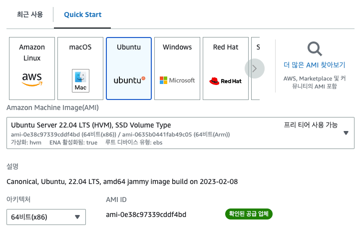
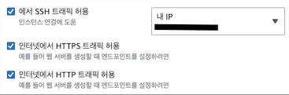

## Mac에서 AWS EC2 인스턴스 생성하기 (프리 티어)

#### 1️⃣ AWS EC2 서비스에 접속하기
EC2 서비스에 접속한 후, 지역을 '서울'로 변경하기

***

#### 2️⃣ 인스턴스 시작 선택 후 옵션 설정
1. ***애플리케이션 및 OS 이미지(Amazon Machine Image)*** 에서 **Ubuntu**, **64비트(x86)** 선택

2. **인스턴스 유형**을 t2.micro(프리티어)로 설정
3. **키 페어** 영역에서 키 페어 이름 선택
   1) 키 페어가 이미 있다면 해당 키 페어 선택
   2) 키 페어가 없다면, **'새 키 페어 생성'** 누르고 이름을 입력하고 키 페어 생성 버튼을 눌러서 키 페어 생성.
     생성 한 후에 다운로드 받은 키 페어는 .ssh 폴더로 이동시킴
     (.ssh 폴더는 기본적으로 숨김 폴더이기 때문에 루트 폴더에서 cmd + shift + . 을 눌러서 숨김 폴더 보이게 한 후, 키 페어 파일을 .ssh 폴더로 이동)
4. **네트워크 설정**에서 밑 사진과 같이 설정  

5. **인스턴스 시작** 버튼을 눌러서 인스턴스 시작하기
   

