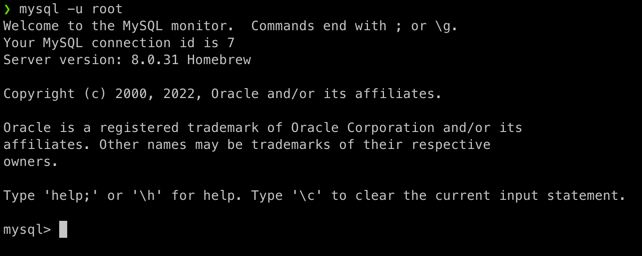

## MySQL password 재설정하기 (Mac)

#### 1. MySQL 서버 종료
```
❯ mysql.server stop
```


<br>

#### 2. MySQL 서버 재시작
```
❯ mysql.server start --skip-grant-tables
```
mysql server를 시작할 때 *--skip-grant-tables* 옵션을 주면  root 인증 없이 MySQL 서버에 접속할 수 있다.

<br>

#### 3. root 계정 접근 후, password를 null로 변경
```
❯ mysql -u root
```
2번 과정을 통해 MySQL에 password 없이 접속할 수 있게 되었다.  
위 명령어를 치면 밑과 같이 mysql로 넘어간다.

<br>

밑 명령어를 전달하여 비밀번호를 임시로 null로 변경한다.
```
mysql> update mysql.user set authentication_string=null where user='root';
```
위 명령어가 제대로 전달이 되었다면 밑과 같이 제대로 적용이 되었다는 문구가 뜨는데, 
그러면 밑 명령어를 전달한다.

```
mysql> flush privileges;
```

<br>

#### 4. MySQL 재시작
```
❯ mysql.server restart;
```

<br>

#### 5. 비밀번호 변경
우선 root 계정으로 MySQL에 들어간 후, 원하는 비밀번호로 변경하면 된다.
```
❯ mysql -u root
```

```
mysql> alter user 'root'@'localhost' identified with caching_sha2_password by '변경할 비밀번호';
```

<br>

#### 6. MySQL 접속
```
❯ mysql -u root -p
```
```
❯ mysql -u root -p
Enter password:
Welcome to the MySQL monitor.  Commands end with ; or \g.
Your MySQL connection id is 10
Server version: 8.0.31 Homebrew

Copyright (c) 2000, 2022, Oracle and/or its affiliates.

Oracle is a registered trademark of Oracle Corporation and/or its
affiliates. Other names may be trademarks of their respective
owners.
```
5번 작업 이후, 위 명령어를 치고 새로 정한 비밀번호를 적으면 MySQL에 제대로 접속되었음을 확인할 수 있다!!

