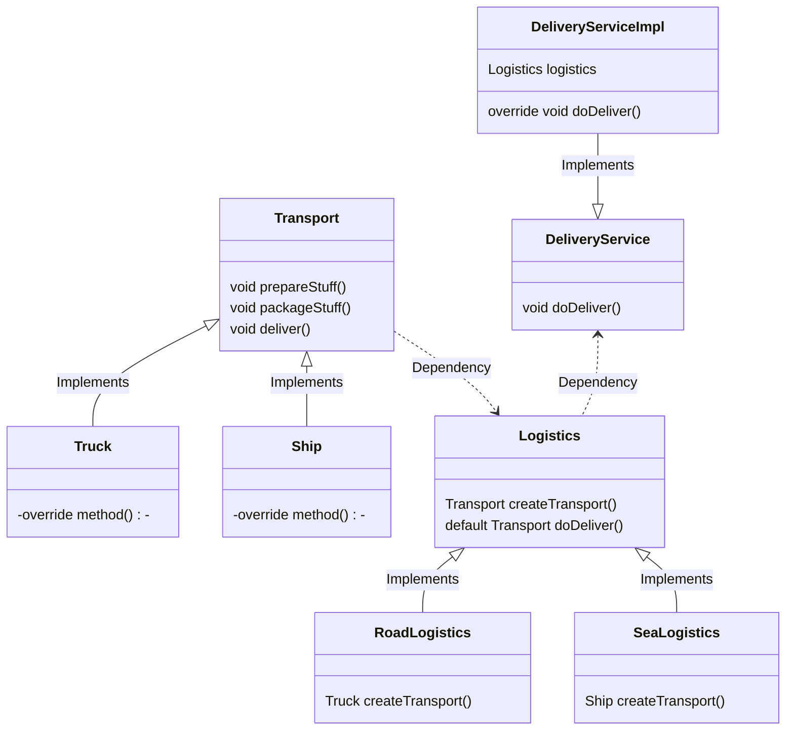

### 문제 상황

>💡 당신은 물류 관리 앱을 개발하는 개발자입니다!  
> ***트럭 운송***을 처리할 수 있는 서비스를 제공하기 때문에, 기능과 관련된 코드가 Truck 클래스에 대부분 존재합니다.  
>그런데 앱이 대박(!)이 나서, 해상 물류 회사에서 ***“배 운송”*** 기능을 앱에 추가해달라는 요청을 받았습니다.

**“배 운송” 기능을 추가하려면 어떻게 해야할까요?**

> “배 운송” 기능을 추가하려면 **Ship이라는 클래스를 새로 생성**하고, Truck 클래스에 있는 **많은 기능들**을 Ship 클래스에 맞게 **변경해서 추가**해야겠지?
>
>
> 기존의 기능들은 Truck 클래스를 받아서 사용하기 때문에, **기존 코드에 Ship도 받아서 사용**할 수 있게 해야겠다!
>
> 하지만 이렇게 하면 중복 코드도 많아지고, 수정해야 할 코드도 너무 많아! 🧐
>

 

### 해결 방법 → 팩토리 메서드 패턴의 컨셉 이용

Truck, Ship과 같은 구체적인 클래스에 의존하지 말고 인터페이스에 의존하자!

객체를 생성하는 클래스를 생성하고 그 곳에서 어떤 객체를 생성할지 정하게 하자!

### 팩토리 메서드 패턴의 구조

Factory Method Pattern(팩토리 메서드 패턴)은 생성 패턴 중 하나로  
“객체를 생성할 때 ***어떤 클래스의 인스턴스를 생성할지 서브 클래스에서 결정***”하는 패턴입니다.

✅  **Product**

Product 인터페이스는 다른 유형 객체들이 가지는 *공통 인터페이스*입니다.
공통된 기능이나 특징을 인터페이스 메서드로 선언함으로써, 공통으로 가져야 할 기능을 구현하게 할 수 있습니다.

구체 제품(ConcreteProductA, ConcreateProductB)들은 Product 인터페이스를 상속받아서 공통 기능을 각자의 기능에 맞게 구현할 수 있습니다.

✅  **Creator**

Product 객체들을 반환하는 Factory method가 여기에 선언됩니다.
Factory method가 **반환하는 객체 유형은 Product(공통 인터페이스 유형)**여야 합니다.

Creator는 ***Abstract class(추상 클래스)***일수도 있고, ***Interface(인터페이스)***일 수도 있습니다.

ConcreateCreator는 Factory method(여기에서는 createProduct)를 override하여 필요한 객체를 반환하도록 합니다.

✅  **Client code**

팩토리 메서드를 사용하는 코드를 “클라이언트 코드”라고 부릅니다.

클라이언트 코드는 실제로 반환되는 여러 객체들 간의 차이점에 대해 몰라도 됩니다.

클라이언트는 여러 객체들을 그저 ***공통 인터페이스 타입***으로 취급하며, ***공통 메서드가 있어야 한다***는 것은 알고 있지만 해당 메서드가 각자 어떻게 동작하는지는 몰라도 되고 호출하여 사용만 하면 됩니다.

### 위 문제에 적용해본다면?

✅  Product(공통 인터페이스) = Transport
ConcreateProduct = Truck, Ship

✅  Creator(팩토리 메서드를 가진 클래스) = Logistics
ConcreteCreator(구체적인 객체를 반환하는 클래스) = RoadLogistics, SeaLogistics

✅  Client code(Creator 클래스를 사용하는 클래스) = DeliveryService(Impl)

### 장단점

✔️ Decoupling → Creator와 ConcreteProduct가 단단하게 결합되지 않도록 할 수 있습니다.

✔️ *단일 책임 원칙(SRP) →*  제품 생성 코드를 한 위치에 모아 두어 유지보수성이 좋아집니다.

✔️ *개방/폐쇄 원칙(OCP) →* 기존 클라이언트 코드를 훼손하지 않고, 새로운 유형(객체)들을 추가할 수 있습니다.

❌ 패턴을 구현하기 위해 작성해야 하는 코드가 더 많아지고, 복잡해질 수 있습니다.