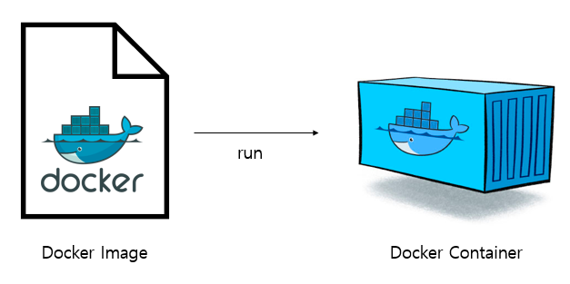

## Docker를 이용하여 mariadb(mysql) 구축하기

> 이번 여름방학동안 하계 인턴을 하게 되었는데, 참여한 프로젝트에서 mariadb를 사용했다.   
> 이전까지 진행했던 프로젝트에서는 mysql만을 사용했기 때문에 local에 직접 설치하여 사용했는데, mariadb를 설치하고 사용하려고 하니 충돌이 나는 문제점이 발생했다.  
> 이로 인해 애를 먹고 있을 때 사수분께서 Docker를 사용해보라는 조언을 해주셨고, 성공하여 기록으로 남기고자 한다.

*이 글은 Mac을 기준으로 하고 있으니 참고 부탁드립니다!*

---
### Docker 설치하기

Mac의 경우 homebrew를 통해서 Docker를 설치할 수 있다.
```
$ brew install docker
혹은
$ brew install --cask docker
```
--cask 옵션을 주게 되면 Mac용 GUI 어플리케이션을 설치한다.

<br>

---
### Docker - image와 container는 무엇인가?
우리는 Docker를 설명할 때에 '컨테이너 기반의 가상화 플랫폼'이라고 이야기한다.  
이는 무엇을 뜻하는 것일까?

Docker에 대한 글을 보다보면 흔히 ***'image(이미지)'*** 와 ***'container(컨테이너)'*** 에 대한 이야기를 많이 듣는다.

이 둘은 무엇이며, 무슨 차이가 있을까?

먼저 ***image(이미지)*** 란 특정 프로세스를 실행하기 위한 모든 파일과 환경(설정 값)을 가지고 있는 파일을 이야기한다.  
이러한 이미지를 통해 Docker에서 추가적인 설치없이 우리가 원하는 프로그램을 실행할 수 있다.  
또한 도커 이미지는 수정이 불가한 불변(Immutable)파일 이며, 하나의 이미지에서 여러 개의 컨테이너를 생성할 수 있다.


***container(컨테이너)*** 란, 이미지를 실행한 하나의 인스턴스이다.  
하나의 도커 이미지로 여러 개의 컨테이너를 생성할 수 있으며, 컨테이너들은 각자 독립된 환경에서 실행된다.  

<br>

---
### Docker를 통해 mariadb(mysql) 이미지 설치하기
mariadb는 mysql 개발진들이 따로 개발한 데이터베이스이기 때문에 mysql 코드와 상당히 유사하며 호환이 가능하다.  
Docker에서 mariadb와 mysql 명령어도 단어를 mariadb를 사용하느냐, mysql을 사용하느냐 정도의 차이이기 때문에 같이 알아보자.

우선 mariadb의 도커 이미지를 다운받자.  
docker pull 명령어를 통해 이미지를 다운받을 수 있으며, pull 뒤에 다운받고자 하는 이미지 명을 써주면 된다.
```
$ docker pull mariadb // mariadb 이미지 다운로드
$ docker pull mysql // mysql 이미지 다운로드
```


---
### Docker 이미지를 통해 컨테이너 실행 후 시작
이미지 다운이 완료되었으면 컨테이너를 실행해보자. 기본적인 컨테이너 실행 명령어는 다음과 같다.
```
$ docker run [옵션] [이미지 명]
```
실행하고자 하는 프로그램의 특성에 따라 다양하게 옵션을 줄 수 있다. 우리는 mariadb를 실행할 것이기 때문에 밑의 명령어를 통해 컨테이너를 실행하자.

```
//docker run --name {컨테이너 명} -d -p 3306:3306 -e MYSQL_ROOT_PASSWORD={root 계정 pw} {이미지 명}
$ docker run --name mariadb-container -d -p 3306:3306 -e MYSQL_ROOT_PASSWORD=1234 mariadb
```
- --name: 실행할 컨테이너의 이름을 지정하는 옵션. *--name mariadb-container* 의 경우 컨테이너의 이름이 mariadb-container로 지정된다.
- -d: detach의 약자로, 컨테이너느 생성한 후 백그라운드에서 실행한다는 의미이다.
- -p: port 번호를 지정하는 옵션. **{host port num}:{container port num}** 의 형태이다.  
    예를 들어 8080:80의 경우, 호스트 시스템에서 8080번 포트로 들어오는 모든 트래픽은 모두 도커의 80번 포트로 전달된다.
- -e: 환경변수를 지정하는 옵션. 위의 경우에서는 root 계정의 비밀번호를 미리 지정하는 옵션을 사용했다.

<br>


---
### 컨테이너 접속 후, mariadb(mysql) 접속하기
```
$ docker exec -it {컨테이너 명} bash
```
기본적으로 docker exec 명령어를 통해 컨테이너에 접속할 수 있다.  
만일 컨테이너의 이름 혹은 ID를 잊었다면 다음 명령어를 통해 확인 할 수 있다.
```
$ docker ps -a
```

<br>

**mysql 접속하기**
```
$ mysql -u root -p
```

**mariadb 접속하기**
```
$ mariadb -u root -p
```
위 명령어를 작성하고, 컨테이너를 생성할 때 설정했던 root 비밀번호를 치면 접속이 가능하다.

<br>

> mariadb에만 접속을 하면 끝이 나는데, 나는 여기서 막혀서 한참을 해맸다.  
구글링을 했을 때에는 mysql, mariadb 상관없이 밑의 명령어를 통해 접속이 가능한 것으로 나왔다.    
하지만 아무리 해봐도 mysql 이라는 명령어를 찾을 수 없다는 대답만 돌아왔고, 컨테이너를 지우고 생성하기를 한참을 반복했다.  
그러던 와중! mysql 명령어가 아닌 mariadb 명령어를 사용해야 한다는 글을 보았고, mariadb 명령어를 통해 mariadb에 접속할 수 있었다.ㅠㅠㅠㅠㅠㅠ