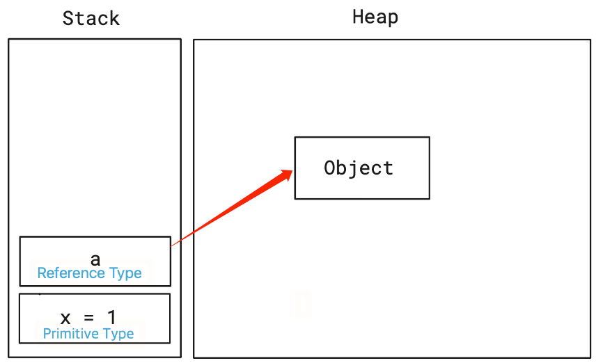
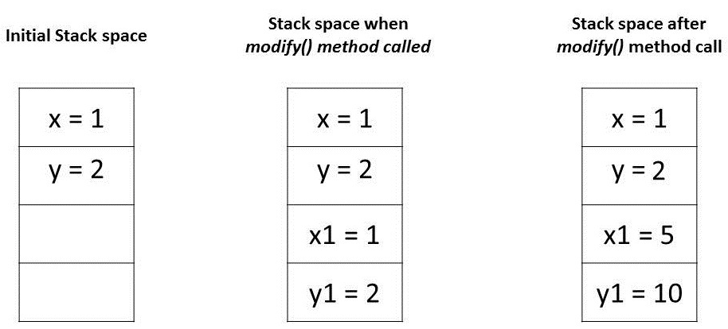
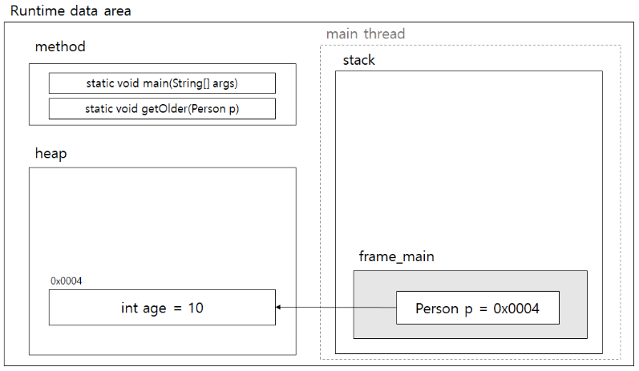
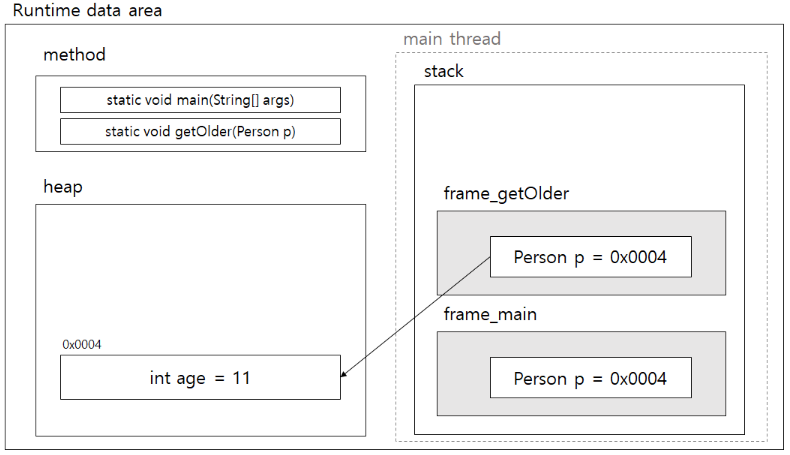
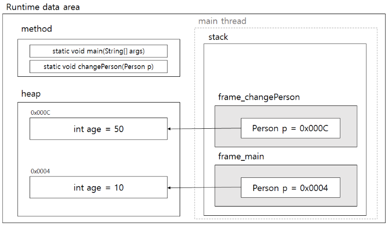

## Java에서는 Call-by-value 방식만 사용한다!
> 프로그래밍 언어를 C와 C++로 먼저 접했기 때문에, 변수의 주소값을 받을 수 있는 & 연산자가 당연했고,  
> 해당 연산자를 유용하게 사용했다.  
> Java에서도 Call-by-reference 방식을 사용하려 했으나, & 연산자가 없다는 사실을 알게 되고..!!  
> 자료를 찾아본 결과 Java에서는 Call-by-value 방식만을 사용한다는 것을 알게되었다.
> 
> 하지만 메서드에 객체를 전달하면 변경이 되던데..? 그런데 Java는 Call-by-value만 사용한다던데..?  
> 이러한 의문점이 들어서 이번 기회에 좀 더 파헤쳐 보고자 한다!

### Java: 변수의 타입과 그에 따른 메모리 저장 위치
> 변수의 타입에는 두 가지가 있다. Primitive(원시) 타입과 Reference(참조) 타입이다.  
> 
> Primitive Type은 기본값이 있는 변수이며, 기본값이 있기 때문에 null을 담을 수 없기 때문에 null을 담고 싶다면 Wrapper class(ex: Integer)를 사용해야 한다.  
> 실제 값을 저장하기 때문에 Stack 영역에 저장된다. int, boolean, double, char, long 등이 여기에 속한다.
> 
> Reference Type은 8가지의 Primitive Type을 제외한 모든 타입을 이야기 한다.  
> null을 담을 수 있으며, 값의 주소 값을 담기 때문에 Heap영역에 저장된다.

JVM에서는 변수 타입에 따라 메모리에 어떻게 저장할까?  
Primitive type에서는 ***Stack 영역에 변수와 함께 저장*** 되며,   
Reference Type는 객체는 ***Heap에 저장*** 되고 ***Stack 영역에 있는 변수가 Heap 영역에 있는 객체를 가리킨다***.

***

<br>

### Primitive type를 전달할 때
primitive type 중 하나인 int 타입의 변수를 메서드의 인자로 전달했을 때에는 호출한 메서드의 stack 공간에 변수들이 저장될 것이다.
``` java
public class PrimitivesUnitTest {
    @Test
    public void whenModifyingPrimitives_thenOriginalValuesNotModified() {
        int x = 1;
        int y = 2;
       
        // modify() 호출 이전에 값 확인
        assertEquals(x, 1);
        assertEquals(y, 2);
        
        modify(x, y);
        
        // modify() 호출 이후에도 값이 같다
        assertEquals(x, 1);
        assertEquals(y, 2);
    }
    
    public static void modify(int x1, int y1) {
        x1 = 5;
        y1 = 10;
    }
}
```
위 코드를 예시로 들어보자.  
1. 초기에는 Stack 공간에 x = 1, y = 2라는 두 개의 공간이 있었을 것이다.  
2. modify(x, y)를 호출하는 순간, 해당 변수들의 값을 복사하여 Stack의 다른 공간에 값을 저장할 것 이다.  
3. modify 함수를 실행하면 Stack에서 modify stack의 자리에는 x1 = 5, y1 = 10의 값이 들어갈 것이다. 하지만 x와 y의 값에는 영향을 끼치지 않는다.


이와 같이 Primitive type의 경우에는 우리가 잘 알고 있는 값을 복사해서 전달하는 Call-by-value 방식으로 작동한다.

***

<br>

### Reference type을 전달할 때
문제는 Reference type을 전달할 때이다.  
Java는 Call-by-value로 작동하니, 객체를 인자로 전달해도 객체 내의 값을 바꿀 수 없어야 할 것 같은데 직접 해보면 값이 변경된다(?!)  
이게 어떻게 된 일일까?  

밑과 같은 예시를 대표적인 예이다.
분명 Call-by-value 일텐데, 객체를 인자로 전달했고 필드값을 변경했더니 함수 종료 이후에도 값 변경이 반영되어 있다..!  

``` java
class Example {
    public static void main(String[] args) {
        Person p = new Person(10);

        // before : 10
        System.out.println("before : "+ p.age);

        getOlder(p);

        // after : 11
        System.out.println("after : "+ p.age);
    }

    private static void getOlder(Person p){
        p.age++;
    }
}
```

나도 이 부분에서 한참동안 헷갈렸던 부분인데,   
Call-by-reference는 변하는 것, Call-by-value는 변하지 않는 것으로 냅다 외워버렸고, 이를 Java에 적용해버리니 생기는 문제점이었다.


Reference type은 위에서 이야기 했듯이, Primitive type과는 달리 객체는 Heap에 저장되고 Stack 영역에 있는 변수가 객체의 주소 값을 가지고 있다.  
Reference type을 인자로 전달하면, 이 때에는 ***"주소 값"*** 을 복사해서 전달한다.  
따라서 main에서 Person 객체를 생성하면 밑의 그림과 같은 상황일 것이다.


그럼 여기서 getOlder 메서드를 실행하면, Call-by-value이지만 주소값을 복사해서 전달하기 때문에 Person의 주소 값이  
Stack의 새로운 공간인 getOlder에 저장이 될 것이다!



이로써 getOlder에서는 전달받은 주소 값을 통해 Person의 값에 접근을 할 수 있는 것이다.  
이러한 점 때문에 객체의 필드 값을 수정할 수 있는 것이고, Call-by-reference와 같은 것이라고 생각하게 되는 것이다.  


> 하지만 아니다. Call-by-reference와는 다르다.  
> 밑과 같은 상황이 과연 ***"참조"*** 가 바뀌었다고 볼 수 있을까?  
> 아니다. 주소값은 바뀌지 않았다. 객체의 ***"상태"*** 가 변경된 것이다. 따라서 Call-by-value이다!

<br>

#### 🧐 그럼 Call-by-reference가 아닌건 어떻게 알아요?

``` java
class Example {
    public static void main(String[] args) {
        Person p = new Person(10);

        // before : 10
        System.out.println("before : "+ p.age);

        changePerson(p);

        // after : 10
        System.out.println("after : "+ p.age);
    }

    private static void changePerson(Person p){
        p = new Person(50);
    }
}
```
위의 코드를 살펴보자.    
changePerson이라는 메서드를 호출하면, 해당 메서드에서는 새로운 Person 객체를 생성할 것이다.  

Stack 영역 안의 changePerson은 기존 객체의 주소 값인 0x0004가 아닌, 0x000C를 갖게 된다.  
따라서 changePerson에서 age의 값을 수정한다 하여도, main에서는 0x0004를 참조하고 있기 때문에 값이 변경되지 않는다.

이로써 Reference type 또한 call-by-value로 전달된다는 것을 알 수 있다.




최종적으로 main 함수의 실행이 모두 끝나게 되면, Stack 영역 내의 changePerson 공간도 사라질 것이다.  
그렇게 되면 위 사진의 heap 영역의 ***0x000C*** 는 아무 곳에서도 참조를 하지 않기 때문에 Garbage Collector에 의해 제거될 것이다.


***
<br>


참고 사이트  
https://www.blog.ecsimsw.com/entry/%EC%9E%90%EB%B0%94%EB%8A%94-Call-by-Value-%EC%9D%B4%EB%8B%A4
https://www.baeldung.com/java-pass-by-value-or-pass-by-reference
https://bcp0109.tistory.com/360