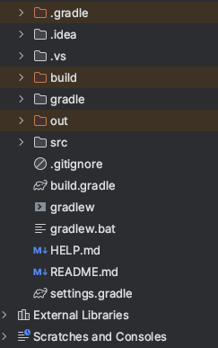

## Gradle이란 무엇인가?

> 인프런의 영한님 강의를 통해 Spring 프레임워크를 처음 접했는데, 이 때부터 기본적으로 Gradle을 사용해왔다.  
> 처음에는 별 생각 없이 사용해왔는데, 최근에 프로젝트에 사용한 기술들을 정리하는 과정에서  
> 'Gradle은 진짜 무엇일까?' 하는 의문점이 들었다.  
> 이번 기회에 Gradle에 대해 알아보려고 한다.

***

### 1. Gradle이란?
> Gradle은 이전 세대 빌드 도구인 Ant, Maven의 단점을 보완하고 장점을 모은 오픈 소스 빌드 자동화 도구이다.

<br>

***

### 2. Gradle의 특징

- Ant와 Maven의 장점을 모아 만들었는데, 의존성 관리를 위한 다양한 방법을 제공하고, 빌드 스크립트를 JVM에서 동작하는 Groovy 기반의 DSL(Domain Specific Language)를 사용한다.

  > DSL(Domain Specific Language)란?
  >
  >
  > 특정 영역(domain)에 특화(Specific)된 언어를 말한다. 특정 영역에서 발생하는 문제점을 해결하는 것에 중점을 둔 것이라고 생각하면 될 것 같다.
  > (훔.. 어렵다..)

- Gradle이 설치되어 있지 않은 시스템에서도 Gradle wrapper를 이용하면 해당 프로젝트를 빌드할 수 있다.
- Maven의 중앙 저장소도 지원을 하기 때문에 라이브러리를 모두 사용할 수 있다.

  > Maven 중앙 저장소(Central Repository)란?  
  >
  > 오픈소스 라이브러리, maven 플러그인 등을 관리하는 저장소이다.

- 직관적인 코드 & 자동 완성

  Ant나 Maven에 비해 직관적이라는 강점이 있는데, Maven의 경우 pom.xml을 사용하기 때문에 가독성이 매우 떨어진다.
  반면 Gradle의 경우에는 Groovy나 Kotlin으로 볼 수 있어서 가독성이 좋다는 장점이 있다.

- 라이브러리 추가

  Gradle의 경우에는 implementation을 이용하여 사용하고자 하는 라이브러리를 추가할 수 있다.

  여기서 testImplementation, runtimeImplementation과 같이 라이브러리의 scope를 지정할 수 있다는 특징이 있다.

<br>

***
### 3. Gradle의 전체적인 구조
> 모든 Gradle script는 하나 이상의 project로 구성되고, 하나의 project는 하나 이상의 task로 구성되어 있다.
> 
> 여기서 Task란 Gradle의 기본적인 실행 단위이며, 의존 관계와 같은 설정도 가능하다.



#### 1) .gradle 디렉토리
gradle 버전 별 엔진 및 설정 파일
#### 2) .idea 디렉토리
에디터와 관련된 파일들
#### 3) gradlew / gradlew.bat
gradle 명령 파일
#### 4) build.gradle
프로젝트에 대한 설정들을 정의(의존관계, 플러그인 등 설정)
#### 5) settings.gradle
빌드할 프로젝트의 정보를 설정

<br>

***
### 4. build.gradle의 구조
#### 1) plugins
``` java
plugins {
    id 'java'
    id 'org.springframework.boot' version '2.7.9'
    id 'io.spring.dependency-management' version '1.0.15.RELEASE'
}
```

plugin은 Gradle Task을 모아놓은 그룹으로, Spring 환경에서 Gradle로 프로젝트를 생성하면 위와 같이 생성이 된다.  
컴파일/패키징/테스트와 같은 작업들을 수행하는데, 이러한 작업들은 Gradle에서 Task 단위로 이루어진다.  
하지만 위와 같은 작업들을 모두 Gradle에 직접 정의한다면 비효율적이기 때문에, 구글이나 JetBrains에서 미리 만들어놓은 plugin들을 사용한다.  

id 'java', id 'org.springframework.boot' version '2.7.9'와 같이 plugin을 적용한 것을 볼 수 있다.

<br>

#### 2) repositories
``` java
repositories {
  mavenCentral()
}
```
Gradle은 위에서 이야기했다시피 Maven 중앙저장소, 로컬저장소, 원격저장소 등  다양한 저장소(Repository)를 지원한다.

<br>

#### 3) dependencies
Gradle에서는 java의 여러가지 의존성을 추가할 수 있다.  
"implementation"을 통해 사용하고자 하는 라이브러리를 추가할 수 있다.  

- implementation
- testImplementation
- testCompileOnly
- testAnnotationProcessor
- compileOnly
- developmentOnly
- annotationProcessor

위와 같이 라이브러리를 가져올 때  test에만 사용할지, compile시에만 적용할지 scope를 적용하여 라이브러리를 추가할 수 있다.

<br>

***

### 5. Gradle의 빌드 속도가 빠른 이유

#### 1) 점진적 빌드 (Incremental build)
점진적 빌드란, 빌드를 실행할 때에 이미 빌드가 완료된 파일은 빌드를 다시 하지 않고, 바뀐 파일들만 빌드하는 것을 말한다.  
예를 들어 파일이 총 15개 있는데, 그 중 3개의 파일만 변경되었다면 변경되지 않은 12개는 빌드하지 않고, 변경된 3개의 파일만 빌드한다.  
이와 같은 방법을 사용하면 빌드하는데에 시간을 단축할 수 있다.

#### 2) 빌드 캐시 (Build Cache)
만약 빌드가 2개 돌아가고 각각을 A, B라고 가정해보자.
만일 A의 빌드에 사용되는 파일들이 B에도 공통적으로 있다면, B를 빌드할 떄에 A의 빌드의 결과물을 가져와 사용할 수 있다.  
이 과정에서 Build Cache를 사용하며, 이를 통해 빌드 시간을 줄일 수 있다.

#### 3) 데몬 프로세스 (Demon process)
Gradle은 demon process를 제공한다.  
***./gradlew build***를 통해 빌드를 진행하면 ***Starting a Gradle Daemon (subsequent builds will be faster)*** 라는 문구를 확인할 수 있다.  
> Demon process란?  
> 서비스의 요청에 응답하기 위해 오랫동안 실행 중인 background 프로세스이다.  
> 유닉스(리눅스) 운영체제에서 "d"로 끝나는 파일들이 주로 여기에 해당한다.

Gradle의 demon process는 빌드 결과물을 메모리에 저장하는데, 이 덕분에 두번째 빌드부터는 이전보다 더 빠른 속도로 빌드가 완료되는 것을 확인할 수 있다.


<br>

***

#### 참고 사이트
- https/kotlinworld.com/311
- https://willbesoon.tistory.com/93
- https://yeonyeon.tistory.com/89