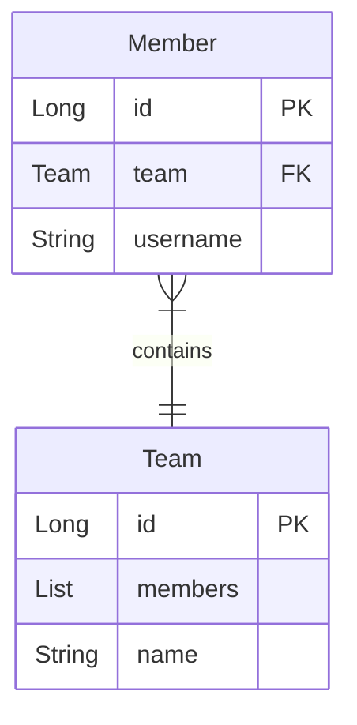

### 01. 다대일

✅ **다대일 양방향[N:1, 1:N]**



```java
public class Member{
	@Id @GerneratedValue
	@Column(name = "MEMBER_ID")
	private Long id;
	private String username;

	@ManyToOne
	@JoinColumn(name = "TEAM_ID") // FK 이름 지정
	private Team team; // 연관관계의 주인

	public void setTeam(Team team){
		this.team = team;
		team.getMembers().add(this); // 상대방의 Member에도 넣어준다
	}
}

public class Team{
	@Id @GerneratedValue
	@Column(name = "TEAM_ID")
	private Long id;
	private String name;
	
	@OneToMany(mappedBy = "team")
	private List<Members> members = new ArrayList<Member>();

	/*public void addMember(Member member){
		this.members.add(member);
		member.setTeam(this);
	}*/
}
```

- 양방향은 FK가 있는 쪽이 연관관계의 주인이다.

  위의 경우에는 **Member.team이 연관관계의 주인**이며, JPA는 FK 관리 시, 연관관계의 주인만 사용한다.

- 양방향 연관관계는 항상 서로를 참조해야 한다.

  양방향 연관관계는 항상 서로를 참조해야 하는데, 연관관계 편의 메소드를 통해 작성할 수 있다.


### 02. 일대다

일대다 관계는 다대일 관계의 반대 방향이다.
일대다 에서는 엔티티를 하나 이상 참조할 수 있으므로, **자바 컬렉션**을 사용해야 한다.

일대다 양방향의 경우에는 다대일 양방향과 같고, 그렇기 때문에 다대일 양방향으로 사용하는 것이 권장된다.

<br>

### 03 일대일 [1:1]

> 일대일 관계는 “주 테이블”이나 “대상 테이블” 둘 중 아무 곳에 FK를 둘 수 있다. 둘 중 하나에만 FK가 있어도 양방향 조회가 가능하다.

> **mappedBy가 없는 곳**이 연관관계의 주인이다!


✅ **주 테이블에 FK : 양방향 연관관계 ✨**

객체지향 개발자들이 주로 선호 & JPA가 더 편리하게 매핑 가능

```java
public class Member{
	@Id @GeneratedValue
	@Column(name = "MEMBER_ID")
	private Long id;
	private String username;

	@OneToOne
	@JoinColumn(name = "LOCKER_ID")
	private Locker locker;
}

public class Locker{
	@Id @GeneratedValue
	@Column(name = "LOCKER_ID")
	private Long id;
	private String name;

	@OneToOne(mappedBy = "locker") //mappedBy를 통해 연관관계의 주인이 아님을 설정
	private Member member;
}
```

연관관계의 주인 → Member.locker

**✅ 대상 테이블에 FK**

JPA에서 일대다 단방향 관계에서 대상 테이블에 FK

```java
public class Member{
	@Id @GeneratedValue
	@Column(name = "MEMBER_ID")
	private Long id;
	private String username;

	@OneToOne(mappedBy = "member")
	private Locker locker;
}

public class Locker{
	@Id @GeneratedValue
	@Column(name = "LOCKER_ID")
	private Long id;
	private String name;

	@OneToOne
	@JoinColumn(name = "MEMBER_ID")
	private Member member;
}
```

주 엔티티인 Member 대신에, 대상 엔티티인 Locker를 연관관계의 주인으로 설정

<br>

### 4. 다대다 [N:N] - 새로운 기본 키 사용

다대다 관계를 다대일 관계로 풀어내는 연결 테이블이 필요하다.

```java
public class Order{
	@Id @GeneratedValue
	@Column(name = "ORDER_ID")
	private Long id;
	
	@ManyToOne
	@JoinColumn(name = "MEMBER_ID")
	private Member member;

	@ManyToOne
	@JoinColumn(name = "PRODUCT_ID")
	private Product product;
	//...
}

public class Member{
	@Id @GeneratedValue
	@Column(name = "MEMBER_ID")
	private Long id;
	private String username;

	@OneToMany(mappedBy = "member")
	private ArrayList<Order> orders = new ArrayList<>();
	//...
}

public class Product{
	@Id @GeneratedValue
	@Column(name = "PRODUCT_ID")
	private Long id;
	private String name;

}
```
<br>

✅ **식별 관계 vs 비식별 관계**


>식별 관계: 받아온 식별자를 PK + FK로 사용  
>비식별 관계: 받아온 식별자는 FK로만 사용하고 새로운 식별자를 추가


객체 입장에서는 2번처럼 비식별 관계를 사용하는 것이, 복합키를 위한 식별자 클래스를 만들지 않아도 되므로 단순하고 편리하게 ORM 매핑을 할 수 있다.

⇒ 비식별 관계를 추천!