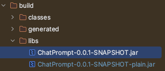

### Java Spring 프로젝트 Gradle로 빌드하기 (mac)


배포하고자 하는 프로젝트를 Gradle을 통해서 빌드할 수 있다.  
먼저 빌드하고자 하는 프로젝트 경로로 이동한다.

*프로젝트 경로에서 **build.gradle** 파일이 있는 곳으로 이동하면 된다!*

프로젝트 경로로 이동한 이후, mac/리눅스의 경우 밑의 명령어를 치면 테스트를 포함하여 프로젝트 전체를 빌드하게 된다.  

```
❯ ./gradlew build
```

만일 테스트 코드를 제외하고 빌드하고 싶다면, 밑의 명령어를 이용하면 된다.
```
❯ ./gradlew build -x test
```

<br>

빌드가 완료되었으면, **build/libs** 경로에 **.jar** 형식으로 있는 것을 확인할 수 있을 것이다.  
*(ex. ChatPrompt-0.0.1-SNAPSHOT.jar)*  
  

<br>

빌드파일을 실행하기 위해서는 우선 cd 명령어를 통해 빌드 파일이 있는 경로(build/libs)로 이동한다.
```
❯ cd build/libs
```
***java -jar*** 명령어를 이용하여 빌드 파일을 실행할 수 있다.   
이름을 직접 치기 힘들기 때문에 ***Tab 키***를 누르면 자동 완성이 된다.
```
❯ java -jar ChatPrompt-0.0.1-SNAPSHOT.jar
```

<br>

> 개인적인 생각으로는 테스트 코드가 실패하면 안되기 때문에 테스트를 포함한 빌드를 하는 것이 더 좋지 않을까 싶다.  
> 빌드하면서 생각치 못했던 테스트 실패가 있을 수도 있고, 테스트 실패는 곧 프로덕션 코드의 에러로 이어질 수 있기 때문이다.  
> *(실제로 그런 적이 왕왕 있었음)*