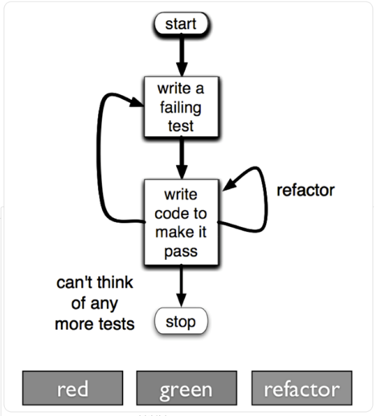

> 이 글은 백명석님 유투브 채널의 클린 코더스 강의를 듣고 기록한 글입니다.

### TDD의 세 가지 principle
✅ Write No production code except to pass a failing test.  
Production 코드를 작성할 때에는 failing test(실패하는 테스트)가 있을 때에만 작성해야 한다.

✅ Write only ENOUGH of a test to demonstrate a failure.  
실패를 나타내는데에 충분할 정도만 test를 작성하라.

✅ Write only ENOUGH production code to pass the test.  
실패하는 테스트가 있으면, 테스트를 통과하는 만큼만 production 코드를 작성하라.

TDD 코드를 작성하다보면 코드가 이미 너무 견고해져서 테스트 코드를 더 작성할 수 없는 경우가 있을 것이다.  
이런 경우를 ***stocking*** 이라고 한다.  
테스트를 잘못된 순서로 추가했을 때 혹은 3가지 law를 지키지 않았을 때 stocking 현상이 발생할 수 있다.


***

### TDD의 과정!


✅ **Red phase - write a failing test**  
failing test 코드를 작성하는 구간. 

✅ **Green phase - write code to make it pass**  
failing test가 통과하도록 production 코드를 작성하는 구간.  
코드가 돌아가도록 최소한의 코드를 작성하면 된다. 이 때에는 copy and paste를 해도 되고, 중복 코드가 있어도 된다.  
돌아가기만 하도록 코드를 작성하면 된다!

✅ **Blue phase - refactor**  
많은 사람들이 Green phase까지는 잘한다. 하지만 refactor는 선택사항으로 두며 뒤로 미룬다.  
하지만 refactoring을 미룬다면 코드의 가독성도 떨어질 것이고, 이후에 수정하기도 쉽지 않다.  
refactor 단계에서는 test나 production에 중복 코드가 없어야 한다!


✅ **stop - can't think of any more tests**  
test가 더 이상 없다면 거기서 멈춘다.

***

### TDD의 원칙/팁

✅ **testcase를 추가할 때 어떤 testcase를 가장 먼저 넣어야 할까?**  
→ most simple! 일단 제일 간단한 것, 해보기 쉬운 것을 먼저 테스트하자!  
→ degenerate! 수준 이하의 것, 제일 간단한 것, 쉬운 것을 먼저 테스트하자!  
그래야 코드가 점진적으로 발전할 수 있고, 생각하는 모든 testcase를 만들 수 있다.

✅ **like a golf game**  
fail이 발생하는 testcode가 있고, 이를 돌아가게 하는 production 코드를 작성할 때, 아주 적은 코드만으로 돌아가게 하자!  
즉, 최소한의 코드로 테스트 코드가 돌아가게 하자!

✅ **테스트가 점점 더 구체화될수록, production 코드는 점점 더 generic해진다.**  
테스트가 다양하고 구체적인 케이스를 건들이게 됨에 따라서, production 코드는 모든 케이스를 수용하여 generic해진다.  
→ 테스트케이스는 점점 더 구체적으로 되는 반면에, production 코드는 점점 범용적이 된다.

***

### TDD의 이점

✅ **Debugging 시간을 줄일 수 있다.**  
우리는 디버깅에 많은 시간을 보내는 것을 원하지 않는다.  
→ TDD를 잘하면 디버깅 시간을 줄일 수 있을 것이다.


✅ **Decoupling**  
테스트하기 어려운 코드가 나오는 이유는, 코드를 먼저 작성하고 테스트를 작성하려고 하기 때문이다.  
테스트를 먼저 만든다면 당연하게도 테스트 코드를 작성하기 어렵지 않을 것이다.  
따라서 test 코드를 먼저 작성하고, production 코드를 작성하면 테스트하기 힘든 코드도 없고, 테스트가 안된 코드도 없을 것이다!


✅ **Courage to change**  
production 코드의 일부를 변경한다고 가정해보자.  
test 코드가 존재하는 경우 기능이 제대로 작동하는지 여부를 확인할 수 있기 때문에, 오류 발생 시에도 어디가 잘못됐는지 쉽게 확인할 수 있다.  

테스트 코드를 통해 시스템이 정상적으로 작동하는지의 여부를 확인할 수 있다면, 개발자가 코드를 변경/개선하는 것을 덜 두려워할 수 있다!  
즉, 테스트 코드가 있다면 refactoring을 더 공격적으로, 적극적으로 할 수 있을 것이다!

✅ **regression test**  
regression 테스트란 이전의 테스트들을 다시 테스트해보는 것을 말한다.  
regression 테스트를 진행하면 production 코드의 신뢰성을 높일 수 있을 것이다.

✅ **Test after development의 문제점**  
개발 이후 테스트를 진행하면, 개발자가 어떤 방식이 잘 돌아가는지 알고 있는 상태에서 테스트를 진행하기 때문에 테스트를 신뢰할 수 없다.  
개발자 입장에서는 개발 완료 이후의 테스트는 지루하기 때문에 테스트가 제대로 진행되지 않을 가능성이 있다.

<br>

***

### TDD 실습
✅ **가정 상황**  
영화 객체(Movie)가 있다. 사용자가 Rate를 정할 수 있고, 여태까지 입력한 Rate의 평균을 구할 수 있다.


✅ **코드 작성**

Movie 객체를 만들고 싶지만, fail test가 없기 때문에 객체를 만들 수 없다.  
우선 MovieTest 클래스를 만들고 테스트 함수를 작성한다.  

Movie movie = new Movie(); 를 작성하면 해당 테스트 함수는 ***실패***할 것이다.  
fail code가 있기 때문에 이제 production code를 작성할 수 있다.

```java
public class MovieTest{
    @Test
    public void canCreateMovie(){
        Movie movie = new Movie();
    }
}
```

Movie에서 option + Enter를 통해 바로 class를 생성하자.  
이후 위 테스트를 실행하면 문제 없이 테스트를 통과하는 것을 확인할 수 있다.  

이 코드에서는 refactor 할 부분이 따로 없기 때문에 리팩토링은 넘어간다.

```java
public class Movie{

}
```

<br>

Movie 객체 생성 이후 그 다음으로 제일 간단한 테스트는 무엇일까?  
객체를 생성한 이후 바로 rating 평균을 바로 구하는 경우일 것이다. 이 경우에는 객체를 생성한 직후이기 때문에 0이 나와야 한다.

Movie 객체의 averageRating() 메서드를 호출하여 값으로 0이 반환되는지 Assertions를 통해 확인한다.

Movie 객체 내에 averageRating() 메서드가 없기 때문에 fail code가 발생한다.  
이제 test 코드가 통과하는 코드를 작성해보자.

```java
public class MovieTest {
    ...
    @Test
    public void should_return_0_when_just_created() {
        Movie movie = new Movie();
        Assertions.assertThat(movie.averageRating()).isEqualTo(0);
    }
}
```

위 fail code에서 averageRating()에 option + Enter 를 통해 Movie 객체 내에 averageRating() 메서드를 추가한다.  
테스트 코드를 통과하기 위한 최소한의 코드를 생각해보면 단순하게 메서드에서 0을 반환하게 하면 될 것이다.  

이 코드에서는 test와 production 코드에서 리팩토링 할 부분이 따로 없기 때문에 리팩토링 과정은 넘어간다.

```java
public class Movie {
    public Integer averageRating() {
        return 0;
    }
}

```

<br>

그 다음으로 간단한 테스트는 Rate에 값을 1로 설정한 다음, Rate의 평균값을 구하면 1이 나오는 경우이다.

마찬가지로 우선 fail code를 작성한다.  
rate() 메서드를 통해 Rate의 값을 설정하고, averageRating() 메서드를 통해 기대값인 1이 나오는지 확인해보자.  
당연히 Movie 객체에 rate() 메서드가 없고, averageRating()에서는 0을 반환하게 했으므로 테스트는 실패할 것이다.

```java
public class MovieTest {
    ...
    @Test
    // 그 다음의 저수준 테스트는 rating에 값을 주고 평균을 구해보는 것
    public void should_return_1_when_1_was_rated() {
        Movie movie = new Movie();
        movie.rate(1);
        Assertions.assertThat(movie.averageRating()).isEqualTo(1);
    }
}
```

test 코드를 통과할 코드를 작성해보자.  
우선 rate() 메서드를 생성하고, 설정한 Rate 값을 더해주는 코드와 Rate의 개수를 올려주는 코드를 작성한다.  
averageRating() 메서드에서는 더한 총 Rate 값을 나누는 과정을 거쳐준다.  
이 때, 0으로 나눠질 수 있으니 삼항 연산자를 통해 countOfRate가 0인 경우에는 0을 반환하도록 한다.

```java
public class Movie {
    private int sumOfRate = 0;
    private int countOfRate = 0;


    public Integer averageRating() {
        return countOfRate == 0 ? 0 : sumOfRate / countOfRate;
    }

    public void rate(int rate) {
        this.sumOfRate += rate;
        countOfRate++;
    }
}
```

<br>

리팩토링을 해야 하는데, 테스트 코드를 보면 각 테스트 메서드에서 Movie 객체를 생성하는 코드가 중복이 되는 것을 알 수 있다.  

Movie 객체를 두 테스트 메서드에서 중복으로 사용하므로 Field로 따로 분리하자.  
Mac 기준 option + command + F를 누르고, Initialized in 항목을 setUp으로 설정하여 리팩토링을 진행하자.

```java
public class MovieTest {
    private Movie movie; // 공통적인 부분은 필드로 빼내자 -> refactoring 과정에서 이루어짐

    @BeforeEach
    void setUp() {
        movie = new Movie();
    }
    
    @Test
    public void should_return_0_when_just_created() {
        Assertions.assertThat(movie.averageRating()).isEqualTo(0);
    }
    
    @Test
    public void should_return_1_when_1_was_rated() {
        movie.rate(1);
        Assertions.assertThat(movie.averageRating()).isEqualTo(1);
    }
}
```


<br>

마지막으로 Rate 값으로 3과 5가 주어졌을 때, 평균값으로 4가 나오는지 확인해보자.  
Test 코드를 작성하고 테스트를 실행하면 무사히 통과하는 것을 확인할 수 있다.

```java
public class MovieTest {
    ...
    @Test
    // 그 다음의 저수준 테스트는 두 개의 rating 값을 주고 평균을 구해보는 것
    public void should_return_4_when_3_and_5_were_rated(){
        movie.rate(3);
        movie.rate(5);
        Assertions.assertThat(movie.averageRating()).isEqualTo(4);
    }
}
```

<br>

>💡 결론!  
> TDD는 
> 1. 기능에 대해 fail test code를 생성하고
> 2. 해당 test 코드를 통과하는 Production 코드를 생성하고
> 3. test, production 코드를 리팩토링  
> 
> 하는 과정을 반복한다!